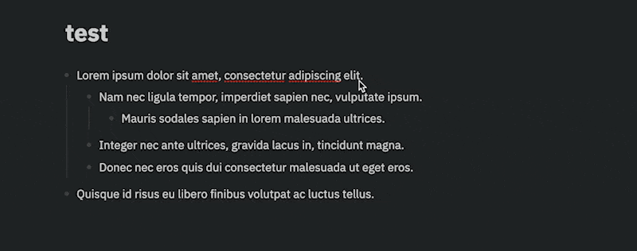

# Bionic Reading plugin for logseq

The plugin relies on [text-vide](https://github.com/Gumball12/text-vide) to transform the paragraph(s). This plugin only introduces the following slash commands.

- `Bionic Reading: Apply`, apply bionic reading only to the current block
- `Bionic Reading: Unapply`, unapply current applied block
- `Bionic Reading: Apply Recursively`, which includes children blocks
- `Bionic Reading: Unapply Recursively`, unapply current block and its children

Inspired by https://www.reddit.com/r/logseq/comments/utkrin/would_make_for_a_cool_plugin/
